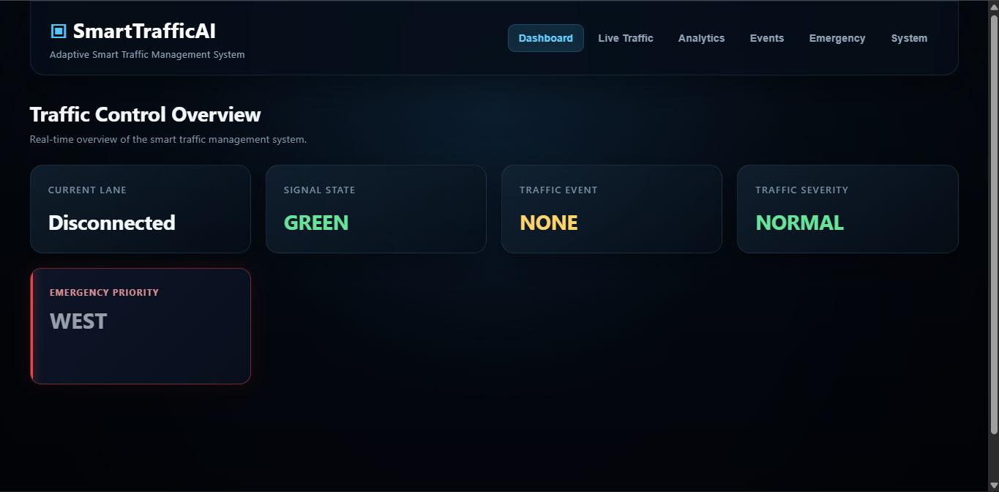
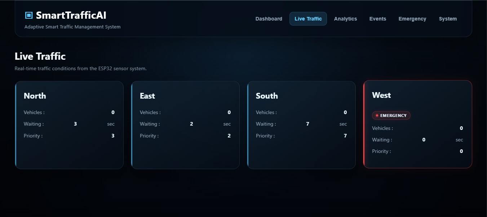
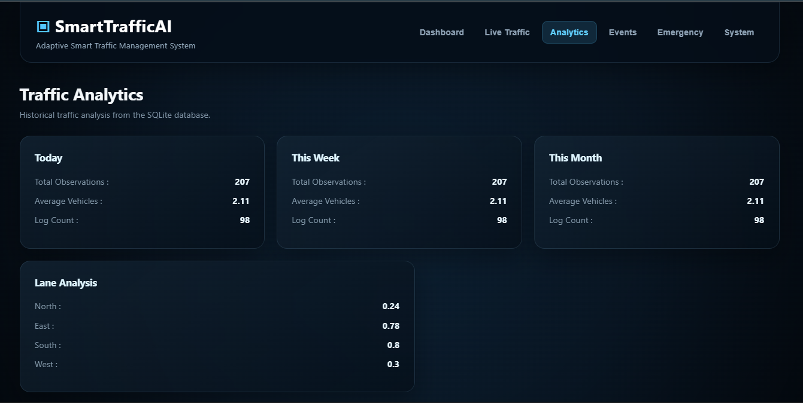
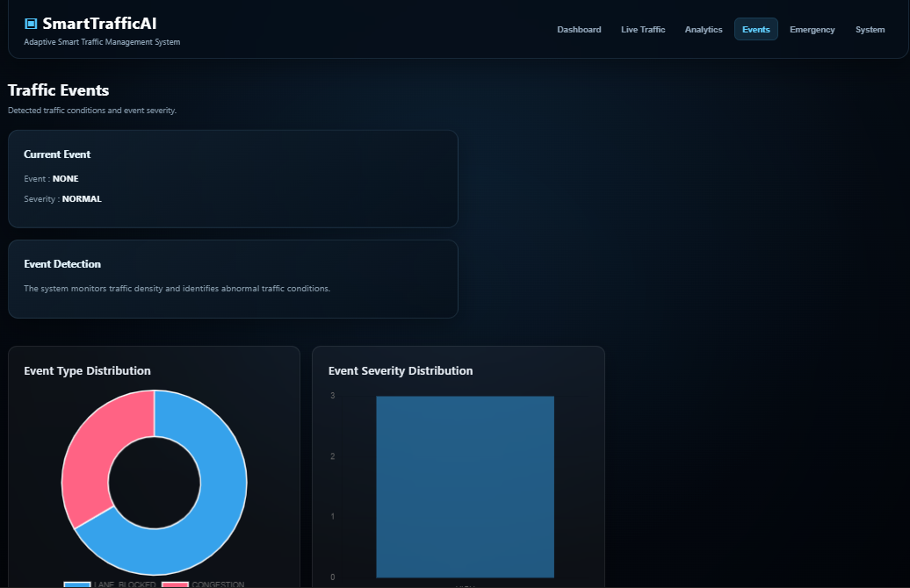
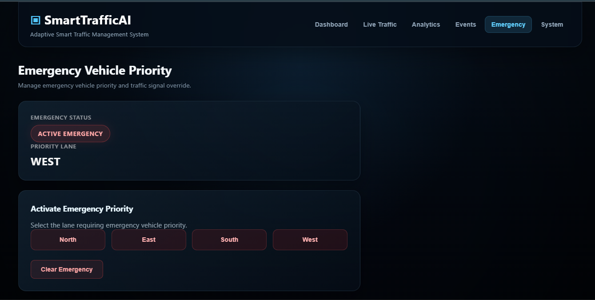

# IoT-Based Adaptive Smart Traffic Management System

## SmartTrafficAI

An IoT-based adaptive traffic management system that monitors traffic conditions across four lanes and dynamically manages traffic signals using vehicle-density information, waiting time, traffic events, and emergency vehicle priority.

The system combines **ESP32-based embedded control, ultrasonic sensing, adaptive signal scheduling, Flask REST APIs, SQLite data logging, and a real-time web dashboard**.

---

## Project Overview

Traditional fixed-time traffic signals provide the same signal duration regardless of the actual traffic condition.

SmartTrafficAI uses real-time traffic information to make lane scheduling more adaptive.

The system:

- Monitors four traffic lanes
- Estimates traffic conditions using ultrasonic sensors
- Calculates lane priority
- Dynamically adjusts Green signal duration
- Tracks lane waiting time
- Detects traffic events
- Classifies event severity
- Provides emergency vehicle priority
- Stores historical traffic information
- Provides traffic analytics
- Displays system information through a web dashboard

---

## Key Features

### Adaptive Traffic Signal Control

Traffic signal scheduling is based on current lane conditions rather than only a fixed sequence.

### Traffic Density Monitoring

Four HC-SR04 ultrasonic sensors provide distance measurements used to estimate traffic conditions for the four lanes.

### Dynamic Green Timing

Green duration is adjusted according to traffic demand and waiting time.

### Lane Priority Calculation

The controller calculates a priority score using traffic conditions, waiting time, and emergency priority.

### Traffic Event Detection

The system supports detection of traffic conditions such as:

- Congestion
- Sudden traffic changes
- Possible lane blockage
- Abnormal traffic conditions

### Traffic Severity

Detected traffic events can be classified as:

- Normal
- Low
- Medium
- High
- Critical

### Emergency Vehicle Priority

An operator can select a lane for emergency priority through the dashboard.

### Historical Traffic Logging

Traffic information is periodically stored using a Flask backend and SQLite database.

### Traffic Analytics

Historical traffic data is used to provide:

- Daily statistics
- Weekly statistics
- Monthly statistics
- Lane-based analysis
- Traffic trends
- Event statistics
- Event history

### Real-Time Web Dashboard

The dashboard provides separate sections for:

- Dashboard
- Live Traffic
- Analytics
- Events
- Emergency
- System

---

## Hardware Components

| Component | Quantity | Purpose |
|---|---:|---|
| ESP32 Development Board | 2 | One Master Traffic Controller and one Sensor Node |
| HC-SR04 Ultrasonic Sensor | 4 | Traffic vehicle/distance detection |
| 4-Way Traffic Light Module | 4 | Traffic signal control for four lanes |
| Breadboard | 1 or more | Hardware prototyping |
| Jumper Wires | As required | Electrical connections |
| USB Cable | As required | ESP32 programming and power |
| Power Supply | As required | System power |

---

## Software Stack

| Technology | Purpose |
|---|---|
| Arduino IDE | ESP32 firmware development |
| C/C++ | Embedded firmware |
| ESP32 Wi-Fi | Network communication |
| HTTP | System API communication |
| JSON | Data exchange |
| Python | Backend development |
| Flask | REST API and backend server |
| Flask-CORS | Cross-origin communication |
| SQLite | Historical traffic storage |
| HTML5 | Dashboard structure |
| CSS3 | Dashboard styling |
| JavaScript | Dashboard logic and API communication |
| Chart.js | Analytics visualization |
| Git | Version control |
| GitHub | Source-code hosting |

---

## System Architecture

```text
                  ┌──────────────────────┐
                  │   HC-SR04 Sensors    │
                  │      4 Lanes         │
                  └──────────┬───────────┘
                             │
                             ↓
                  ┌──────────────────────┐
                  │    Sensor ESP32      │
                  │  Sensor Processing   │
                  └──────────┬───────────┘
                             │
                        JSON Data
                             │
                             ↓
                  ┌──────────────────────┐
                  │     Master ESP32     │
                  │  Traffic Controller  │
                  └──────────┬───────────┘
                             │
              ┌──────────────┼──────────────┐
              ↓              ↓              ↓
       Traffic Signals   Event Logic   Emergency
                             │
                             ↓
                  ┌──────────────────────┐
                  │    Web Dashboard     │
                  └──────────┬───────────┘
                             │
                             ↓
                  ┌──────────────────────┐
                  │    Flask Backend     │
                  └──────────┬───────────┘
                             │
                             ↓
                  ┌──────────────────────┐
                  │    SQLite Database   │
                  └──────────────────────┘
```

For the detailed architecture, see:

**[Architecture Documentation](docs/Architecture.md)**

---

## Traffic Signal Control

The Master ESP32 controls four traffic lanes:

- North
- East
- South
- West

The controller uses a Finite State Machine (FSM).

```text
PRE_GREEN_YELLOW_STATE
          ↓
     GREEN_STATE
          ↓
    YELLOW_STATE
          ↓
   ALL_RED_STATE
          ↓
       Next Lane
```

The signal transition mechanism provides a defined Yellow and All-Red interval between lane changes.

---

## Adaptive Traffic Management

The current base Green timing is:

| Traffic Condition | Green Time |
|---|---:|
| 0 vehicles | 10 seconds |
| 2 vehicles | 15 seconds |
| 4 vehicles | 20 seconds |
| 6 vehicles | 25 seconds |
| 8 vehicles | 30 seconds |
| 10+ vehicles | 35 seconds |

Waiting-time bonuses are also applied:

| Waiting Time | Additional Time |
|---|---:|
| Less than 10 seconds | 0 seconds |
| 10 seconds or more | +3 seconds |
| 20 seconds or more | +5 seconds |

The maximum Green duration is limited to **40 seconds**.

---

## Emergency Vehicle Priority

The system allows an operator to assign emergency priority to a selected lane.

```text
Emergency Lane Selection
          ↓
Master ESP32
          ↓
Emergency Priority
          ↓
Highest Lane Priority
          ↓
Signal Scheduling
          ↓
Emergency Lane
```

Lane mapping:

| Index | Lane |
|---:|---|
| `0` | North |
| `1` | East |
| `2` | South |
| `3` | West |

The dashboard provides controls to activate and clear emergency priority.

---

## Traffic Events

The system monitors traffic conditions and supports the following event types:

```text
NONE
CONGESTION
SUDDEN_TRAFFIC
LANE_BLOCKED
ABNORMAL
```

Confirmed events are assigned severity levels:

```text
NORMAL
LOW
MEDIUM
HIGH
CRITICAL
```

A stability period is used to reduce false event detection caused by temporary sensor changes.

---

## Data Logging and Analytics

Traffic status is periodically sent from the dashboard to the Flask backend.

```text
Master ESP32
      ↓
Traffic Status
      ↓
Dashboard
      ↓
Flask REST API
      ↓
SQLite Database
      ↓
Analytics API
      ↓
Dashboard Charts
```

Historical information includes:

- Timestamp
- Lane traffic values
- Current lane
- Signal state
- Traffic event
- Traffic severity

---

## Dashboard

The web dashboard provides the following sections:

| Section | Purpose |
|---|---|
| Dashboard | System overview |
| Live Traffic | Real-time lane information |
| Analytics | Historical traffic analysis |
| Events | Event monitoring and history |
| Emergency | Emergency priority control |
| System | System and connectivity information |

---

## Screenshots

### Dashboard



### Live Traffic



### Analytics



### Events



### Emergency Priority



> Screenshots shown above are captured from the working SmartTrafficAI dashboard prototype.

---

## Project Structure

```text
Smart-Traffic-Management-System/
│
├── backend/
│   ├── api/
│   ├── database/
│   ├── models/
│   ├── routes/
│   ├── services/
│   └── app.py
│
├── dashboard/
│   ├── index.html
│   ├── app.js
│   └── style.css
│
├── diagrams/
│
├── docs/
│   ├── API.md
│   ├── Architecture.md
│   ├── Setup.md
│   └── UserGuide.md
│
├── firmware/
│   ├── sensor_node/
│   ├── traffic_controller/
│   └── Traffic_Light_Test/
│
├── .gitignore
└── README.md
```

---

## Documentation

Detailed project documentation is available here:

| Document | Description |
|---|---|
| [Architecture](docs/Architecture.md) | System architecture, hardware/software design, data flow, and control architecture |
| [API Documentation](docs/API.md) | Master ESP32 and Flask REST API reference |
| [Setup Guide](docs/Setup.md) | Hardware, firmware, backend, dashboard setup, and testing |
| [User Guide](docs/UserGuide.md) | Dashboard operation and system usage |

---

## Installation

For complete installation instructions, see:

**[Setup Guide](docs/Setup.md)**

The general setup process is:

```text
Configure ESP32 Firmware
          ↓
Connect Hardware
          ↓
Upload Sensor Firmware
          ↓
Upload Master Firmware
          ↓
Configure Network
          ↓
Install Python Dependencies
          ↓
Start Flask Backend
          ↓
Start Dashboard
          ↓
Verify System
```

---

## API

The main APIs are:

| Component | Endpoint | Method |
|---|---|---|
| Master ESP32 | `/status` | `GET` |
| Master ESP32 | `/emergency` | `POST` |
| Master ESP32 | `/clear-emergency` | `POST` |
| Flask Backend | `/api/traffic/log` | `POST` |
| Flask Backend | `/api/traffic/analytics` | `GET` |

For complete request and response information:

**[API Documentation](docs/API.md)**

---

## Limitations

The current prototype uses ultrasonic sensors for traffic detection.

The available hardware supports traffic-density estimation, vehicle presence/distance measurement, congestion-related detection, and traffic anomaly detection.

The current system does not reliably provide:

- Vehicle speed measurement
- Driver behavior analysis
- License plate recognition
- Vehicle identification
- Reliable rash-driving detection
- Reliable hit-and-run identification

These capabilities would require additional sensing technologies such as cameras, speed sensors, or vehicle-tracking systems.

---

## Future Improvements

Potential future improvements include:

- Camera-based vehicle detection
- Vehicle-speed measurement
- Automatic emergency vehicle detection
- License plate recognition
- Improved traffic prediction
- Machine-learning-based traffic forecasting
- Cloud-based monitoring
- Mobile application
- Advanced vehicle tracking
- Multi-intersection coordination

---

## Project Status

The current prototype includes:

- [x] Four-lane traffic monitoring
- [x] ESP32 sensor integration
- [x] Traffic-light control
- [x] FSM-based signal transitions
- [x] Adaptive Green timing
- [x] Lane priority calculation
- [x] Waiting-time handling
- [x] Traffic event detection
- [x] Traffic severity classification
- [x] Emergency vehicle priority
- [x] SQLite traffic logging
- [x] Historical traffic analytics
- [x] Web dashboard
- [x] Emergency dashboard synchronization

---

## Technologies

```text
Embedded
├── ESP32
├── Arduino IDE
└── C/C++

Sensors
└── HC-SR04 Ultrasonic Sensors

Backend
├── Python
├── Flask
├── Flask-CORS
└── SQLite

Frontend
├── HTML5
├── CSS3
├── JavaScript
└── Chart.js

Version Control
├── Git
└── GitHub
```

---

## Repository

The complete source code, firmware, dashboard, backend, diagrams, and documentation are maintained in this repository.

**Repository:**  
https://github.com/Anil-962/SmartTrafficAI

---

## License

This project is developed as an academic major project.

The source code is currently provided for academic and demonstration purposes.
