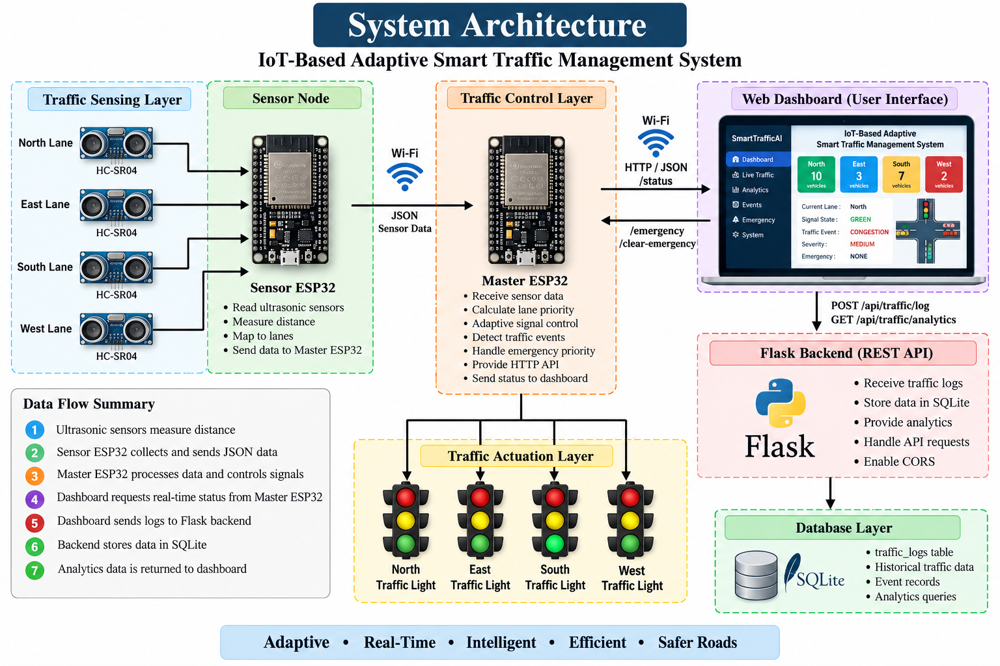
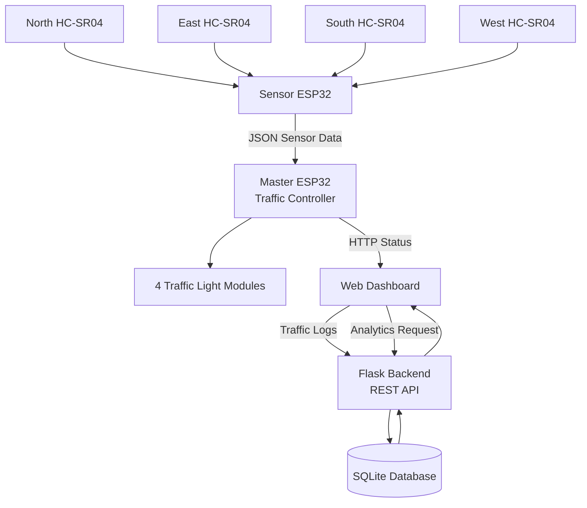
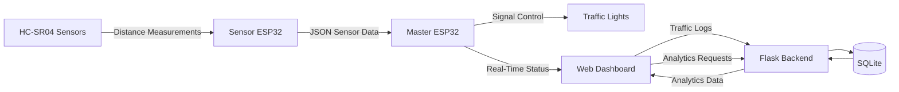

# System Architecture

  
## 1. Overview

The IoT-Based Adaptive Smart Traffic Management System is designed as a distributed traffic-control system consisting of two ESP32 boards, ultrasonic sensors, traffic-light modules, a Flask backend, SQLite database, and a web-based dashboard.

The system continuously monitors traffic conditions, calculates lane priority, dynamically adjusts Green signal duration, detects traffic events, provides emergency vehicle priority, and stores historical traffic information for analytics.

---

## 2. High-Level Architecture

The system consists of the following major components:

- Sensor ESP32
- Four HC-SR04 ultrasonic sensors
- Master ESP32 traffic controller
- Four traffic-light modules
- Flask backend
- SQLite database
- Web dashboard

The high-level architecture is:



## 3. Hardware Architecture

The hardware layer consists of two ESP32 boards.

### Sensor ESP32

The Sensor ESP32 is responsible for:

- Reading the four HC-SR04 ultrasonic sensors
- Measuring distance values
- Associating sensor measurements with traffic lanes
- Sending sensor information to the Master ESP32

### Master ESP32

The Master ESP32 is the main traffic controller.

It is responsible for:

- Receiving sensor information
- Updating lane traffic conditions
- Calculating lane priority
- Managing waiting time
- Calculating adaptive Green duration
- Controlling traffic-light signals
- Detecting traffic events
- Calculating event severity
- Handling emergency priority
- Providing HTTP endpoints
- Reporting system status

### Hardware Flow

```text
        NORTH SENSOR
             │
        EAST SENSOR
             │
       SOUTH SENSOR
             │
        WEST SENSOR
             │
             ↓
      ┌──────────────┐
      │ Sensor ESP32 │
      └──────┬───────┘
             │
        JSON Data
             │
             ↓
     ┌─────────────────┐
     │  Master ESP32   │
     │ Traffic Control │
     └────────┬────────┘
              │
       ┌──────┼──────┐
       ↓      ↓      ↓
   Traffic  Traffic  Traffic
    Light    Light    Light
       │
       ↓
   4-Lane Signal Control
```

## 4. Four-Lane Traffic Model

The system manages four traffic lanes:

| Lane | Direction |
|---|---|
| North | North |
| East | East |
| South | South |
| West | West |

Each lane maintains traffic information including:

- Vehicle count
- Waiting time
- Priority score
- Emergency status

The controller uses this information to determine which lane should receive the next Green signal.

## 5. Software Architecture

The software is divided into three main layers:

```text
┌────────────────────────────────────┐
│          Dashboard Layer           │
│   HTML + CSS + JavaScript +        │
│             Chart.js               │
└──────────────────┬─────────────────┘
                   │ HTTP / JSON
                   ↓
┌────────────────────────────────────┐
│           Backend Layer            │
│          Flask REST API            │
│         Traffic Logging            │
│            Analytics               │
└──────────────────┬─────────────────┘
                   │ SQLite
                   ↓
┌────────────────────────────────────┐
│          Database Layer            │
│              SQLite                │
└────────────────────────────────────┘
```

The embedded traffic-control layer operates independently on the ESP32 system:

```text
HC-SR04 Sensors
      ↓
Sensor ESP32
      ↓
Master ESP32
      ↓
Traffic Control Logic
      ↓
Traffic Light Modules
```

## 6. Sensor Data Flow

The Sensor ESP32 collects distance measurements from the four ultrasonic sensors.

The measurements are associated with the corresponding lanes and transmitted to the Master ESP32 as JSON data.

```text
HC-SR04
   ↓
Distance Measurement
   ↓
Sensor ESP32
   ↓
JSON
   ↓
Master ESP32
   ↓
Lane Traffic Information
```

Example sensor data:

```json
{
    "north": 55.0,
    "east": 31.1,
    "south": 59.1,
    "west": -1.0
}
```

A value such as `-1.0` represents an invalid or unavailable distance measurement.

## 7. Traffic Processing Architecture

The Master ESP32 processes the incoming sensor information.

The processing sequence is:

```text
Sensor Data
     ↓
Distance Processing
     ↓
Traffic Density
     ↓
Lane Information
     ↓
Priority Calculation
     ↓
Lane Selection
     ↓
Adaptive Green Time
     ↓
Traffic Signal Control
```

The priority calculation considers:

- Vehicle density
- Waiting time
- Emergency priority

## 8. Lane Priority Architecture

Each lane receives a priority score based on its current traffic condition.

```text
             Lane Data
                │
       ┌────────┼────────┐
       ↓        ↓        ↓
   Vehicles  Waiting  Emergency
       │        │        │
       └────────┼────────┘
                ↓
        Priority Calculation
                ↓
          Priority Score
                ↓
       Highest-Priority Lane
```

The controller uses the calculated priority to determine which lane should be served next.

Emergency priority is assigned a substantially higher weight than normal traffic factors.

## 9. Adaptive Signal Control

The Green signal duration is dynamically determined from traffic density and waiting time.

The current adaptive timing model is:

| Traffic Condition | Base Green Time |
|---|---:|
| 0 vehicles | 10 seconds |
| 2 vehicles | 15 seconds |
| 4 vehicles | 20 seconds |
| 6 vehicles | 25 seconds |
| 8 vehicles | 30 seconds |
| 10+ vehicles | 35 seconds |

Waiting-time bonuses are also applied:

| Waiting Time | Additional Time |
|---|---:|
| Less than 10 seconds | 0 seconds |
| 10 seconds or more | +3 seconds |
| 20 seconds or more | +5 seconds |

The maximum Green duration is limited to **40 seconds**.

```text
Traffic Density
      +
Waiting Time
      ↓
Adaptive Green-Time Calculation
      ↓
Green Signal Duration
```

## 10. Traffic Signal State Machine

The Master ESP32 controls signal transitions using a Finite State Machine (FSM).

The implemented states are:

| State | Purpose |
|---|---|
| `PRE_GREEN_YELLOW_STATE` | Yellow transition before Green |
| `GREEN_STATE` | Allows traffic through the selected lane |
| `YELLOW_STATE` | Transition from Green toward stopping |
| `ALL_RED_STATE` | Safety interval before the next lane |

### Signal Sequence

```text
PRE_GREEN_YELLOW_STATE
          ↓
     GREEN_STATE
          ↓
    YELLOW_STATE
          ↓
   ALL_RED_STATE
          ↓
       Next Lane
          ↓
PRE_GREEN_YELLOW_STATE
```

The use of explicit states ensures that signal transitions follow a predictable sequence.

## 11. Traffic Event Architecture

The Master ESP32 continuously analyzes traffic conditions to detect abnormal traffic patterns.

The supported event types are:

- `NONE`
- `CONGESTION`
- `SUDDEN_TRAFFIC`
- `LANE_BLOCKED`
- `ABNORMAL`

The event-processing flow is:

```text
Traffic Data
     ↓
Density Analysis
     ↓
Current vs Previous Conditions
     ↓
Event Detection
     ↓
5-Second Stability Check
     ↓
Confirmed Event
     ↓
Severity Calculation
```

A detected event must remain stable for approximately five seconds before it is treated as a confirmed event.

## 12. Traffic Severity Architecture

Confirmed traffic events are assigned a severity level.

The supported severity levels are:

- `NORMAL`
- `LOW`
- `MEDIUM`
- `HIGH`
- `CRITICAL`

```text
Confirmed Traffic Event
          ↓
Traffic Condition Analysis
          ↓
Severity Calculation
          ↓
NORMAL / LOW / MEDIUM / HIGH / CRITICAL
          ↓
Dashboard + Database
```

The event and severity information are included in the Master ESP32 status response and are also stored in historical traffic logs.

## 13. Emergency Priority Architecture

The system provides emergency vehicle priority for a selected traffic lane.

The emergency mechanism can be activated through the dashboard using the Master ESP32 HTTP API.

```text
Emergency Lane Selection
          ↓
Master ESP32
          ↓
Emergency Priority Enabled
          ↓
Highest Lane Priority
          ↓
Signal Scheduling
          ↓
Emergency Lane Green
```

The four lane indexes are:

| Index | Lane |
|---:|---|
| `0` | North |
| `1` | East |
| `2` | South |
| `3` | West |

Emergency priority does not bypass the defined signal-state transition mechanism. The controller continues to use its Yellow and All-Red transition states before providing Green to the selected emergency lane.

## 14. Dashboard Architecture

The dashboard is a single-page web interface implemented using:

- HTML5
- CSS3
- JavaScript
- Chart.js

The dashboard communicates directly with the Master ESP32 for real-time status information.

```text
             Master ESP32
                  │
             GET /status
                  │
                  ↓
          JavaScript Application
                  │
        ┌─────────┼─────────┐
        ↓         ↓         ↓
   Live Traffic Analytics Events
        │         │         │
        └─────────┼─────────┘
                  ↓
             Web Interface
```

The dashboard contains the following sections:

- Dashboard
- Live Traffic
- Analytics
- Events
- Emergency
- System

## 15. Backend Architecture

The Flask backend is responsible for historical traffic data management and analytics.

```text
Dashboard
    │
    ├── POST /api/traffic/log
    │
    └── GET /api/traffic/analytics
              │
              ↓
       Flask REST API
              │
       ┌──────┴──────┐
       ↓             ↓
Traffic Logger   Analytics
       │             │
       └──────┬──────┘
              ↓
        SQLite Database
```

The backend separates traffic logging from real-time ESP32 monitoring.

This allows the dashboard to obtain frequent real-time updates while historical traffic data is stored periodically.

## 16. Database Architecture

SQLite is used for persistent storage of historical traffic information.

The main table is:

```text
traffic_logs
```

The table stores:

- Timestamp
- North vehicle count
- East vehicle count
- South vehicle count
- West vehicle count
- Current lane
- Signal state
- Traffic event
- Traffic severity

```text
Flask Backend
      ↓
Traffic Logger
      ↓
traffic_logs
      ↓
SQLite Database
      ↓
Analytics Queries
      ↓
Dashboard
```

## 17. Complete System Data Flow

The complete data flow can be represented as:



## 18. Complete Control Loop

The traffic controller operates continuously using the following control loop:

```text
Read Traffic Data
       ↓
Update Lane Information
       ↓
Detect Traffic Events
       ↓
Calculate Event Severity
       ↓
Check Emergency Priority
       ↓
Calculate Lane Priority
       ↓
Select Lane
       ↓
Calculate Green Time
       ↓
Control Traffic Signal
       ↓
Update Dashboard Status
       ↓
Historical Logging
       ↓
Repeat
```

This architecture allows the system to respond to changing traffic conditions instead of relying only on a fixed-time traffic signal sequence.

## 19. Component Responsibilities

| Component | Main Responsibility |
|---|---|
| HC-SR04 Sensors | Detect vehicle distance/presence |
| Sensor ESP32 | Collect and transmit sensor measurements |
| Master ESP32 | Main traffic-control processing |
| Traffic Light Modules | Display traffic signal states |
| Flask Backend | Traffic logging and analytics API |
| SQLite | Historical traffic-data storage |
| JavaScript Dashboard | Real-time monitoring and user interaction |
| Chart.js | Traffic and event visualization |

## 20. Architecture Summary

The system follows a distributed architecture in which sensing, traffic control, data storage, and visualization are separated into logical components.

The Sensor ESP32 handles sensor acquisition, while the Master ESP32 performs the primary traffic-control operations. The web dashboard provides real-time monitoring and operator controls, while the Flask backend and SQLite database provide historical storage and analytics.

This separation makes the system easier to test, maintain, and extend with additional traffic-management capabilities in the future.
